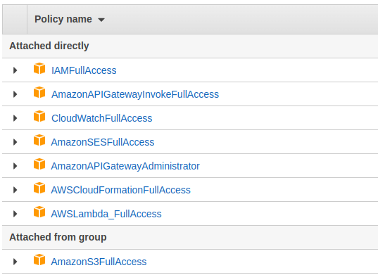

# Lambda function
Testing lambda function to aws using serverless

Running local

```sh

$ npm run invoke:local

```

Deploy 

```sh

$ npm run deploy

```

Permissions to aws



```json
// 20220803221911
// https://vsppd42g31.execute-api.us-east-1.amazonaws.com/?key=something

{
  "message": "There is cache!",
  "cached": "something from cache",
  "input": {
    "version": "2.0",
    "routeKey": "GET /",
    "rawPath": "/",
    "rawQueryString": "key=something",
    "headers": {
      "accept": "text/html,application/xhtml+xml,application/xml;q=0.9,image/avif,image/webp,image/apng,*/*;q=0.8,application/signed-exchange;v=b3;q=0.9",
      "accept-encoding": "gzip, deflate, br",
      "accept-language": "en-US;q=0.7",
      "cache-control": "max-age=0",
      "content-length": "0",
      "dnt": "1",
      "host": "vsppd42g31.execute-api.us-east-1.amazonaws.com",
      "sec-fetch-dest": "document",
      "sec-fetch-mode": "navigate",
      "sec-fetch-site": "none",
      "sec-fetch-user": "?1",
      "sec-gpc": "1",
      "upgrade-insecure-requests": "1",
      "user-agent": "Mozilla/5.0 (X11; Linux x86_64) AppleWebKit/537.36 (KHTML, like Gecko) Chrome/103.0.5060.134 Safari/537.36",
      "x-amzn-trace-id": "Root=1-62eb1e8f-5045b1dc6a48f64548a758b6",
      "x-forwarded-for": "45.175.106.28",
      "x-forwarded-port": "443",
      "x-forwarded-proto": "https"
    },
    "queryStringParameters": {
      "key": "something"
    },
    "requestContext": {
      "accountId": "697336819503",
      "apiId": "vsppd42g31",
      "domainName": "vsppd42g31.execute-api.us-east-1.amazonaws.com",
      "domainPrefix": "vsppd42g31",
      "http": {
        "method": "GET",
        "path": "/",
        "protocol": "HTTP/1.1",
        "sourceIp": "45.175.106.28",
        "userAgent": "Mozilla/5.0 (X11; Linux x86_64) AppleWebKit/537.36 (KHTML, like Gecko) Chrome/103.0.5060.134 Safari/537.36"
      },
      "requestId": "WUG2Ygd8IAMEJ5g=",
      "routeKey": "GET /",
      "stage": "$default",
      "time": "04/Aug/2022:01:19:11 +0000",
      "timeEpoch": 1659575951069
    },
    "isBase64Encoded": false
  }
}
```